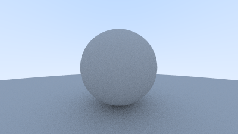
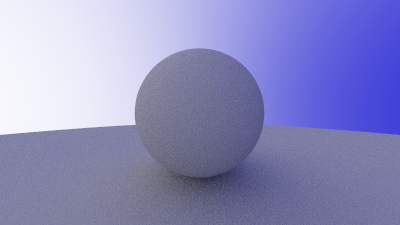

# Radium

Radium is a simple bare-bones Ray Tracing Engine written in C++ that runs on the CPU. Frames rendered by Radium are saved in PPM format.

## Instructions

- `git clone --recursive https://github.com/soumik12345/Radium`

- Make sure you have CMake installed for your system.

- `sh ./build_and_run.sh`

## Demos

### Simple Diffuse Sphere

<table>
    <thead>
        <td>
            Demo 1
        </td>
        <td>
            Demo 2
        </td>
    </thead>
    <tbody>
        <td></td>
        <td></td>
    </tbody>
</table>

### Accurate Rendering of Lambertian Sphere

<table>
    <thead>
        <td>
            Demo 1
        </td>
        <td>
            Demo 2
        </td>
    </thead>
    <tbody>
        <td></td>
        <td></td>
    </tbody>
</table>
