# Radium

A simple bare-bones Ray Tracing Engine written in C++14. Frames rendered by Radium are saved in PPM format.

## Simple Ray-Traced Sphere

<table>
    <thead>
        <td>
            Demo 1
        </td>
        <td>
            Demo 2
        </td>
    </thead>
    <tbody>
        <td>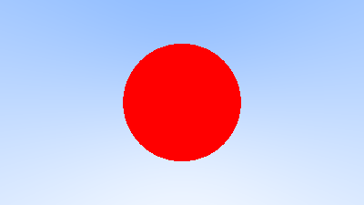</td>
        <td>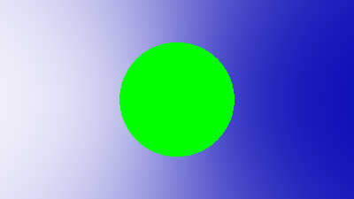</td>
    </tbody>
</table>

## Shading with Surface Normals

<table>
    <thead>
        <td>
            Demo 1
        </td>
        <td>
            Demo 2
        </td>
    </thead>
    <tbody>
        <td>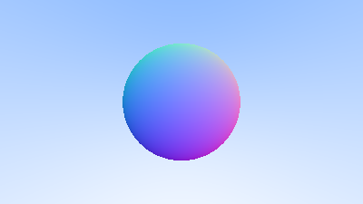</td>
        <td>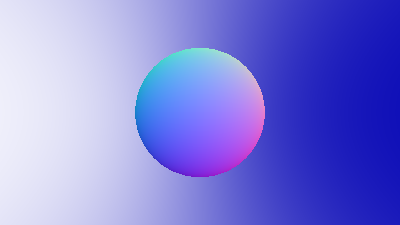</td>
    </tbody>
</table>

## World as a List of Multiple Hittables

<table>
    <thead>
        <td>
            Demo 1
        </td>
        <td>
            Demo 2
        </td>
    </thead>
    <tbody>
        <td>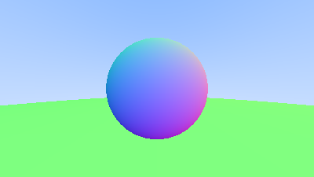</td>
        <td>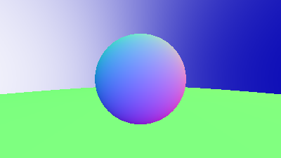</td>
    </tbody>
</table>

## Antialiasing

<table>
    <thead>
        <td>
            Demo 1
        </td>
        <td>
            Demo 2
        </td>
    </thead>
    <tbody>
        <td>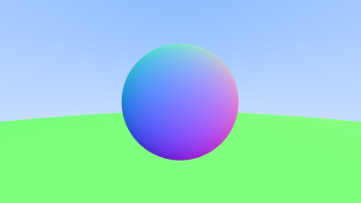</td>
        <td>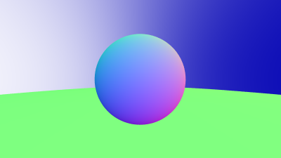</td>
    </tbody>
</table>

## Simple Diffuse Sphere

<table>
    <thead>
        <td>
            Demo 1
        </td>
        <td>
            Demo 2
        </td>
    </thead>
    <tbody>
        <td>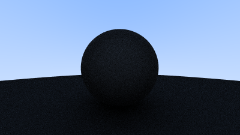</td>
        <td>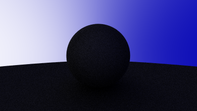</td>
    </tbody>
</table>

## Simple Diffuse Sphere with Gamma Correction

<table>
    <thead>
        <td>
            Demo 1
        </td>
        <td>
            Demo 2
        </td>
    </thead>
    <tbody>
        <td>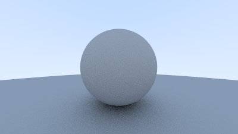</td>
        <td>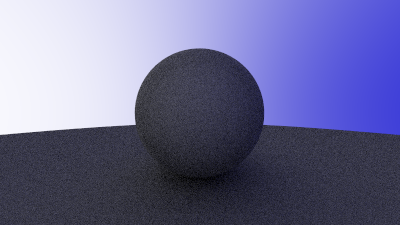</td>
    </tbody>
</table>
