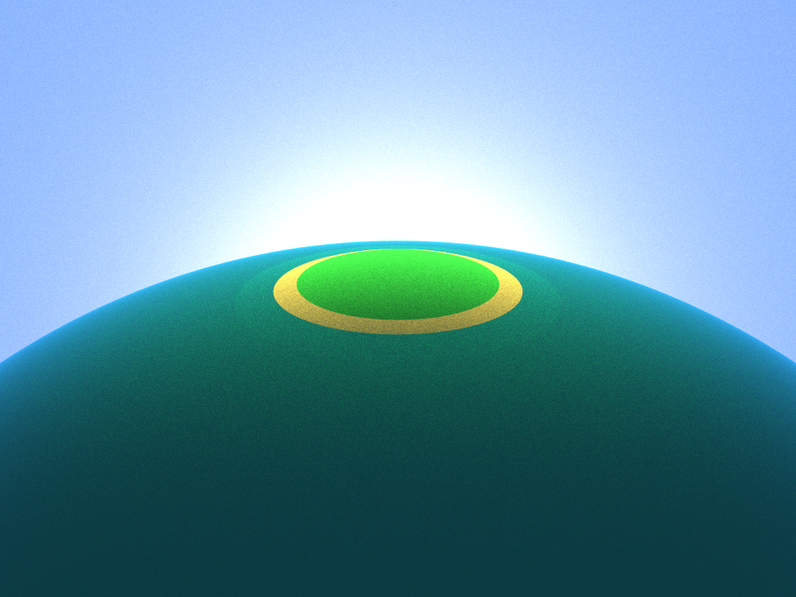
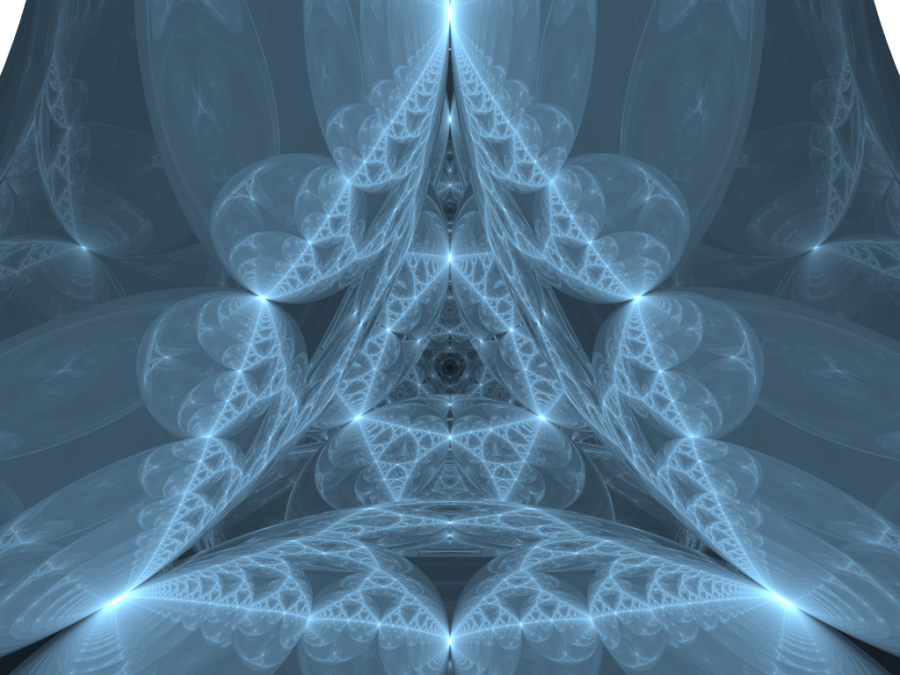
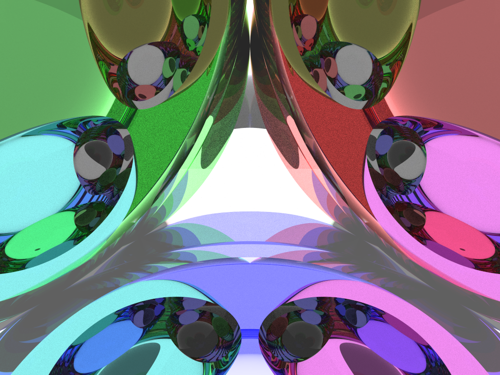
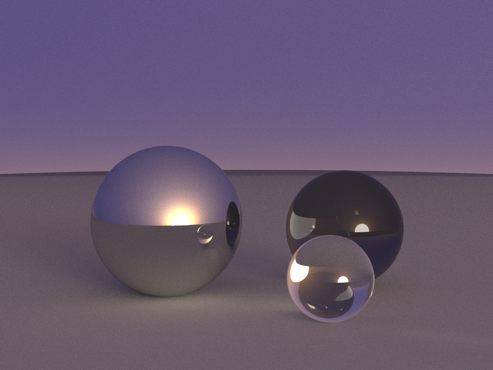

# Radium

Radium is a small and lightweight Ray Tracing Engine written in C++ that runs on the
CPU using shared-memory multiprocessing.

## Features

- Simple and easy-to-use API.

- Global illumination using Unbiased Monte Carlo Path Tracing.

- Soft shadows from Diffuse Light Sources.

- Specular, Diffuse, and Refractive Materials are supported.

- Total Internal Reflection for Refractive Materials.

- Russian Roulette for path termination.

- Radium has been tested on MacOS and Linux. Support for Windows is Experimental via WSL.

## Build Instructions

- `git clone --recursive https://github.com/soumik12345/Radium`

- `sh ./install.sh linux` in order to install the python dependencies. For MacOs, use argument `mac`.

- Make sure you have CMake installed for your system.

- Edit to include the engine code `src/main.cpp`.

- `sh ./build_and_run.sh`

- In order to run Radium on Google Colab, refer to
  [](https://colab.research.google.com/github/soumik12345/Radium/blob/monte_carlo/notebooks/Demo.ipynb)

## API Usage Example

Rendering a [Cornell Box](https://en.wikipedia.org/wiki/Cornell_box) is considered a standard benchmark for a
rendering system. The basic environment consists of:

- One light source in the center of a white ceiling
- A green right wall
- A red left wall
- A white back wall
- A white floor

We will try to add two more objects, a DIFFUSE and a REFRACTED object.

```c++
#include "Radium.h"


int main() {

    // Step 1: Create an instance of the Radium Renderer
    Renderer renderer(1024, 768, 5000); // Parameters -> Frame Width, Frame Height, Samples per Pixel

    // Step 2: Set the position and direction of the Renderer Camera
    renderer.setCameraPosition(50, 50, 295.6); // Set Position of the Renderer Camera
    renderer.setCameraDirection(0, -0.042612, -1); // Set Direction of Renderer Camera

    // Step 3: Create the Scene by placing Spherical Objects
    // Parameters for Sphere -> Radius, Position, Emission, Color, Material
    renderer.addObject(
            Sphere(1e5, Vector3(1e5 + 1, 40.8, 81.6), Vector3(), Vector3(.75, .25, .25), DIFFUSE)); // Left Wall
    renderer.addObject(
            Sphere(1e5, Vector3(-1e5 + 99, 40.8, 81.6), Vector3(), Vector3(.25, .25, .75), DIFFUSE)); // Right Wall
    renderer.addObject(
            Sphere(1e5, Vector3(50, 40.8, 1e5), Vector3(), Vector3(.75, .75, .75), DIFFUSE)); // Back Wall
    renderer.addObject(
            Sphere(1e5, Vector3(50, 40.8, -1e5 + 170), Vector3(), Vector3(), DIFFUSE)); // Front Wall
    renderer.addObject(
            Sphere(1e5, Vector3(50, 1e5, 81.6), Vector3(), Vector3(.75, .75, .75), DIFFUSE)); // Bottom Floor
    renderer.addObject(
            Sphere(1e5, Vector3(50, -1e5 + 81.6, 81.6), Vector3(), Vector3(.75, .75, .75), DIFFUSE)); // Top Ceiling
    renderer.addObject(
            Sphere(16.5, Vector3(27, 16.5, 47), Vector3(), Vector3(1, 1, 1) * .999, SPECULAR)); // Shiny Surface Ball
    renderer.addObject(
            Sphere(16.5, Vector3(73, 16.5, 78), Vector3(), Vector3(1, 1, 1) * .999, REFRACTED)); // Glass Ball
    renderer.addObject(
            Sphere(600, Vector3(50, 681.6 - .27, 81.6), Vector3(12, 12, 12), Vector3(), DIFFUSE)); // Light Source

    // Step 4: Render the Scene
    renderer.render(true); // Parameter -> Flag to turn on Progressbar or not

    // Step 5: Export the Scene and Camera Settings to CSV files
    // These CSV files can be parsed by renderer.importCamera and renderer.importWorld methods
    renderer.exportWorld("cornell_box_world.csv");
    renderer.exportCamera("cornell_box_camera.csv");

    return 0;
}
```

This gives us the following result:


This took 100 minutes to render on Intel Core i5 8th Gen.

You can also render a scene from the exported CSV files as shown below,

```c++
#include "Radium.h"


int main() {

    Renderer renderer(1024, 768, 40);

    renderer.importCamera("../scenes/cameras/demo_4_camera.csv");
    renderer.importWorld("../scenes/worlds/demo_4_world.csv");

    renderer.render(true);

    return 0;
}

```

### Points to be Noted:

- Radium supports only spherical objects, other shapes are not supported.
  In order to render flat surfaces, we can use a sphere with a large radius
  and place the camera close to it, so that the curvature of the surface is not noticeable.
  
- If you are using build_and_run.sh, make sure that your world file
  ends with `world.csv` and camera file with `camera.csv`.
  
- By default, the World settings are exported at `./scenes/worlds`,
  the camera settings are exported at `./scenes/cameras` and
  the rendered image is exported at `./dump` in both ppm and png format.
  
- Radium achieves parallelism in the computation using an OpenMP `#pragma`
  to dynamically allocate rows of the image to different threads for each processor or core.
  Hence, if you have openmp installed on your system, it would significantly increase the rendering speed.
  
- Rendering time increases with increase in samples per pixel.
  Rendering at lower samples per pixel however increases black dot artifacts.

## Demos

### Demo 1



|Frame Dimensions|Number of Objects|Samples per Pixel|Processor|Render Time|
|----------------|-----------------|-----------------|---------|-----------|
|(1024, 768)|7|5000|Intel Core i5 8th Gen|91 Miniutes|


### Demo 2



|Frame Dimensions|Number of Objects|Samples per Pixel|Processor|Render Time|
|----------------|-----------------|-----------------|---------|-----------|
|(1024, 768)|5|40|Intel Core i5 8th Gen|2 Minutes|

### Demo 3



|Frame Dimensions|Number of Objects|Samples per Pixel|Processor|Render Time|
|----------------|-----------------|-----------------|---------|-----------|
|(1024, 768)|7|200|Intel Core i5 8th Gen|4 Minutes|

### Demo 4



|Frame Dimensions|Number of Objects|Samples per Pixel|Processor|Render Time|
|----------------|-----------------|-----------------|---------|-----------|
|(1024, 768)|9|5000|Intel Core i5 8th Gen|71 Minutes|

## Acknowledgement

- [An improved illumination model for shaded display](https://dl.acm.org/doi/10.1145/358876.358882)
  by [Turner Whitted](https://dl.acm.org/profile/81100586999).
  
- [The rendering equation](https://dl.acm.org/doi/10.1145/15922.15902)
  by [James T Kajiya](https://dl.acm.org/profile/81100653012).
  
- Data for constructing the demo images have been taken from the demos of Kevin Beason's
  [smallpt](http://www.kevinbeason.com/smallpt/extraScenes.txt)
  
- [An Introduction to Ray Tracing](https://amzn.to/2Op60pm).
  
- [Realistic Ray Tracing](https://amzn.to/3rZIvkB) by [Peter Shirley](https://twitter.com/Peter_shirley).
